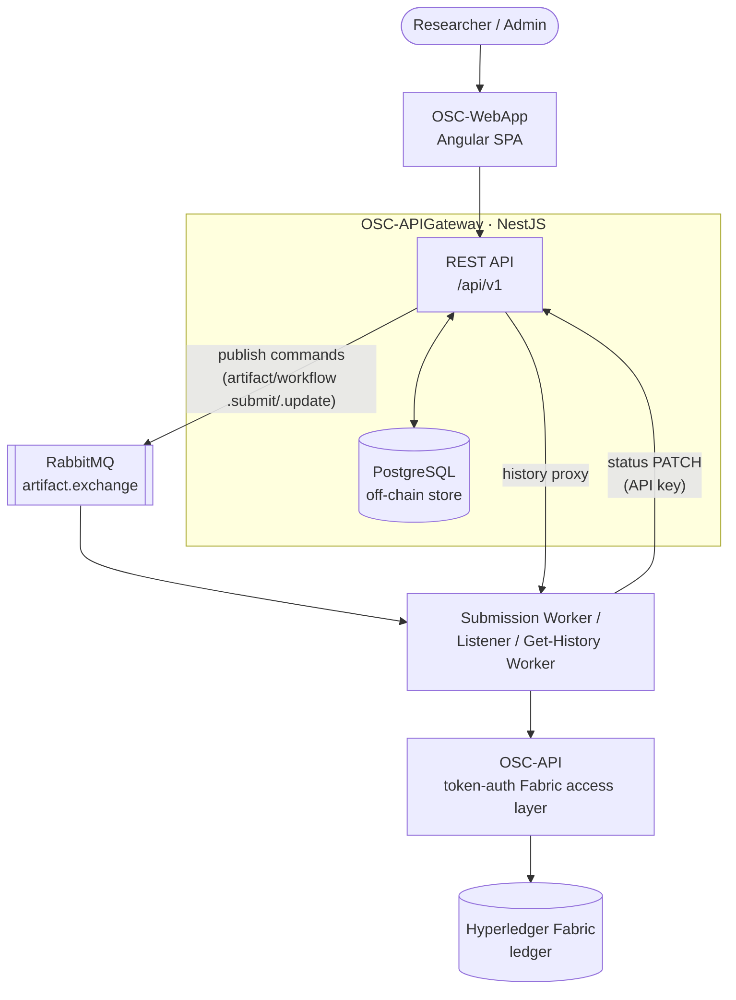
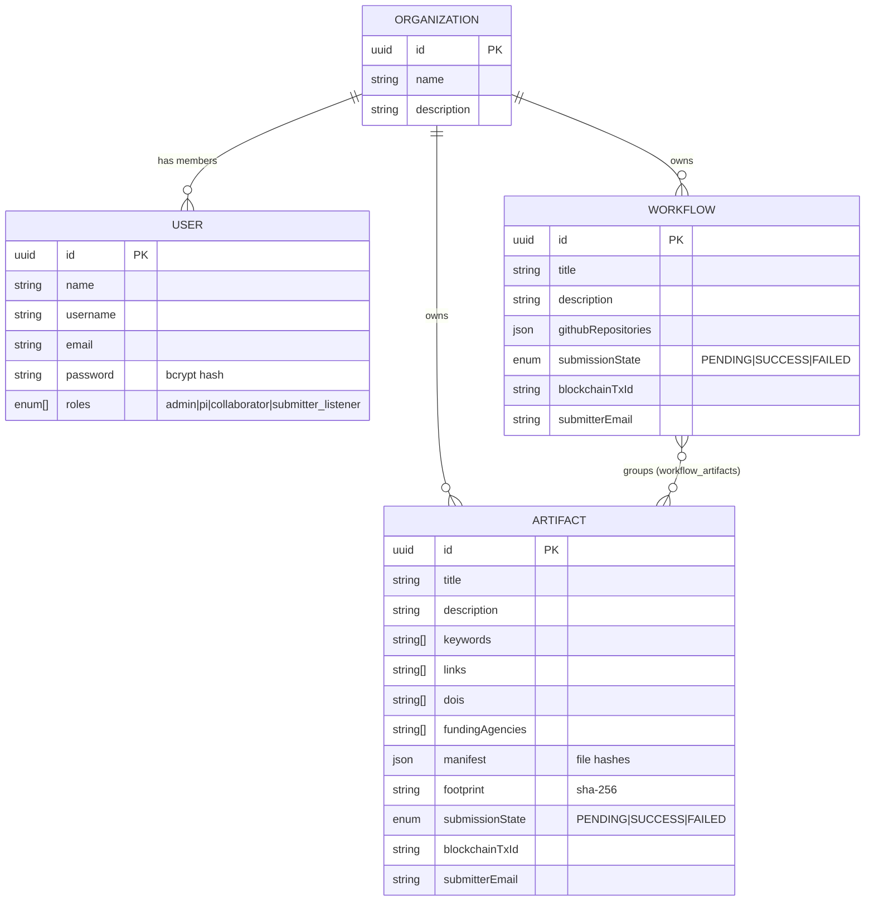
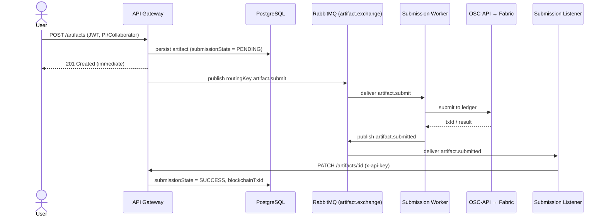

# OSC-APIGateway

> The central REST API and orchestration layer of the **Open Science Chain – Information System (OSC-IS)**.

OSC-APIGateway is a [NestJS](https://nestjs.com/) (TypeScript) service that sits between the OSC web application and the rest of the OSC-IS platform. It owns user/organization management, authentication and authorization, the off-chain relational store of research **artifacts** and **workflows**, and the publication of submission commands onto the message bus that ultimately writes records to a Hyperledger Fabric blockchain.

---

## Executive summary

The Open Science Chain (OSC) lets researchers register research **artifacts** (datasets, code, documents) and **workflows** (collections of artifacts + linked GitHub repositories) on a tamper-evident blockchain ledger so their provenance and integrity can be independently verified. The API Gateway is the "front door" to that system:

- It is the **only component the web app talks to**. Everything the user sees — login, organizations, artifacts, workflows, history — is served here.
- It keeps a **fast off-chain copy** of every artifact/workflow in PostgreSQL so the UI is responsive, while the **authoritative, immutable copy** lives on the blockchain.
- It enforces **who can do what** (role-based access control) and **what valid data looks like** (schema validation, cryptographic hashes).
- It hands slow, blockchain-bound work to **asynchronous background workers** over a message queue, so the user gets an instant response and the ledger write happens behind the scenes.

If you only read one diagram, read [System context](#system-context) below.

---

## Table of contents

- [System context](#system-context)
- [What this service is responsible for](#what-this-service-is-responsible-for)
- [Technology stack](#technology-stack)
- [Domain model](#domain-model)
- [Authentication & authorization](#authentication--authorization)
- [Asynchronous submission pipeline](#asynchronous-submission-pipeline)
- [Project structure](#project-structure)
- [Running locally](#running-locally)
- [Testing](#testing)
- [Documentation](#documentation)

---

## System context



> **Note on the Fabric access path.** Earlier architecture diagrams showed an S3 bucket holding Hyperledger identities that workers would mount directly. That design was **not** shipped. In the delivered system, blockchain access is brokered by the **OSC-API** service, which authenticates callers with a token and performs the actual peer interactions. The API Gateway never talks to Fabric directly.

---

## What this service is responsible for

| Responsibility | Detail |
|---|---|
| **Identity & access** | Login (JWT issuance), logout (token blacklist), users, organizations, role-based authorization. |
| **Artifact lifecycle** | Create / read / update / delete artifacts; track on-chain submission state. |
| **Workflow lifecycle** | Create / read / update workflows (artifacts + GitHub repositories grouped together). |
| **Off-chain persistence** | PostgreSQL via TypeORM — the queryable mirror of on-chain data. |
| **Command publication** | Publishes `*.submit` / `*.update` commands to RabbitMQ for asynchronous blockchain writes. |
| **Status reconciliation** | Accepts authenticated PATCH callbacks from the submission listener to record on-chain results. |
| **History proxy** | Proxies artifact-history reads to the Get-History Worker (which reads the ledger via OSC-API). |

---

## Technology stack

| Concern | Choice |
|---|---|
| Language / runtime | TypeScript on Node.js |
| Framework | NestJS 10 (modular, DI-based) |
| HTTP | Express platform adapter, URI versioning (`/api/v1`), global `ValidationPipe` |
| Persistence | PostgreSQL via TypeORM 0.3 (`synchronize: true`) |
| AuthN/AuthZ | Passport (`local`, `jwt` strategies), `@nestjs/jwt`, custom guards |
| Password hashing | bcrypt |
| Messaging | RabbitMQ via `amqplib` (topic exchange) |
| Validation | `class-validator` / `class-transformer` DTOs and entities |
| Testing | Jest (unit + e2e), SQLite in-memory for repository tests |
| Code quality | ESLint + Prettier, Husky + lint-staged pre-commit, SonarCloud |

---

## Domain model



**Key points**

- Every **artifact** and **workflow** belongs to exactly one **organization** (`ManyToOne`, `CASCADE` on delete).
- A **workflow** groups many artifacts through the `workflow_artifacts` join table (`ManyToMany`).
- Integrity fields — per-file `manifest` hashes and a top-level `footprint` (SHA-256, validated by `^[a-f0-9]{64}$`) — are what make the on-chain record verifiable.
- `submissionState` (`PENDING → SUCCESS | FAILED`) tracks the asynchronous blockchain write; `blockchainTxId` / `peerId` are filled in once the ledger confirms.

See [docs/artifact-api.md](docs/artifact-api.md), [docs/organization-api.md](docs/organization-api.md), [docs/user-api.md](docs/user-api.md), and [docs/workflow-api.md](docs/workflow-api.md) for full request/response references.

---

## Authentication & authorization

Two authentication schemes coexist, selected per-endpoint by guards:

1. **JWT (human users)** — `POST /api/v1/users/login` validates credentials (bcrypt) and issues a signed JWT carrying `{ username, sub, roles, email }`. The `JwtAuthGuard` protects user-facing endpoints; logout blacklists the token in memory.
2. **API key (service-to-service)** — the submission listener authenticates its status callbacks with `x-api-key` + `x-service-role` headers (`ApiKeyAuthGuard`), not a JWT.

Authorization is **role-based** via the `@Roles(...)` decorator + `RolesGuard`:

| Role | Meaning | Can create artifacts/workflows | Can administer users/orgs | Can PATCH on-chain status |
|---|---|:--:|:--:|:--:|
| `admin` | OSC-IS operators | – | ✅ | – |
| `pi` | Principal Investigator | ✅ | – | – |
| `collaborator` | Researcher | ✅ | – | – |
| `submitter_listener` | Automated listener (service) | – | – | ✅ (API key) |

> A frequent source of "must be authenticated" errors is a logged-in **admin** trying to create an artifact — only `pi` and `collaborator` may do so by design.

---

## Asynchronous submission pipeline

The gateway never blocks the user on a blockchain write. Creating an artifact is a two-phase, event-driven flow:



The gateway publishes through a single **topic exchange** `artifact.exchange` with routing keys `artifact.submit`, `artifact.update`, `workflow.submit`, and `workflow.update`. Domain writes and outbox commands commit in one database transaction. Publisher confirms acknowledge delivery to RabbitMQ; unavailable commands retry with backoff and move to a failed state after the configured limit. Every ledger-bound command carries server-generated user, organization, operation, timestamp, and correlation metadata.

---

## Project structure

```
src/
├── main.ts                 # Bootstrap: CORS allowlist, URI versioning, validation pipe
├── app.module.ts           # Root module, TypeORM + Postgres config (TLS-aware)
├── auth/                   # JWT + local + API-key strategies, guards, RBAC, token blacklist
├── user/                   # User entity, CRUD, auth-facing lookups
├── organization/           # Organization entity + CRUD
├── artifact/               # Artifact entity, controller, service, history proxy (ghw.service)
├── workflow/               # Workflow entity, controller, service
├── messaging/              # RabbitMQ producer (rabbitmq.service)
├── health/                 # Liveness endpoint
└── shared/                 # Enums, decorators, errors, interceptors, validators
```

---

## Running locally

```bash
./scripts/security/secure-install.ps1
# or: bash scripts/security/secure-install.sh

# Provide environment (see docs/environment-variables.md)
# Minimum: DB_*, JWT_SECRET, RABBITMQ_*, admin seed users

npm run start:dev          # watch mode on :3000
```

A `docker-compose.yml` is provided to bring up PostgreSQL alongside the service for integration testing. The companion message-bus + workers live in [OSC-Artifact-Submission](../OSC-Artifact-Submission).

> **Data persistence:** `dropSchema` was removed from the TypeORM config, so the database is **no longer wiped on restart**. In staging, the database is seeded from a snapshot of curated blockchain artifacts on bring-up.

---

## Testing

```bash
npm run test          # unit tests (Jest)
npm run test:cov      # with coverage
npm run test:e2e      # end-to-end
npm run test:cov -- --testPathPattern=artifact   # single module
```

Repository-layer tests run against an in-memory SQLite database (`src/shared/testing-utils/typeorm-testing-config.ts`), so no PostgreSQL is required for unit tests.

---

## Documentation

| Document | Contents |
|---|---|
| [docs/ARCHITECTURE.md](docs/ARCHITECTURE.md) | Architectural patterns, tactics, prioritized quality attributes, and the rationale behind them. |
| [docs/artifact-api.md](docs/artifact-api.md) | Artifact endpoints. |
| [docs/workflow-api.md](docs/workflow-api.md) | Workflow endpoints. |
| [docs/organization-api.md](docs/organization-api.md) | Organization endpoints. |
| [docs/user-api.md](docs/user-api.md) | User & auth endpoints. |
| [docs/environment-variables.md](docs/environment-variables.md) | Configuration reference. |

---

*Part of the OSC-IS platform. See the sibling repositories: [OSC-WebApp](../OSC-WebApp), [OSC-Artifact-Submission](../OSC-Artifact-Submission), [OSC-IS-Infra](../OSC-IS-Infra), [OSC-API](../OSC-API), [OSC-Chaincode](../OSC-Chaincode), [OSC-Docker](../OSC-Docker), [OSC-Network](../OSC-Network).*
