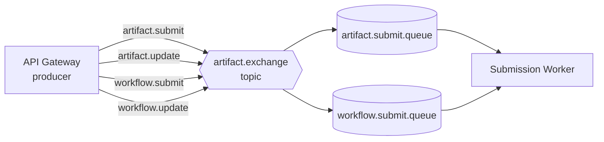
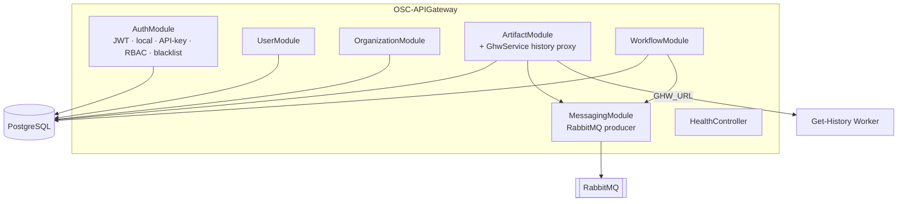
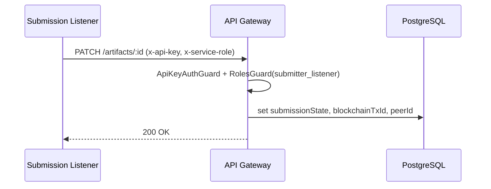

# OSC-APIGateway — Architecture

This document describes the architecture of the OSC-IS API Gateway: the **architectural patterns and tactics** it employs, the **quality attributes** they were chosen to satisfy, and the **trade-offs** behind each decision. It is written to be useful both as an engineering reference and as source material for reporting on the system's design.

- [1. Architectural context](#1-architectural-context)
- [2. Prioritized quality attributes](#2-prioritized-quality-attributes)
- [3. Architectural patterns](#3-architectural-patterns)
- [4. Architectural tactics by quality attribute](#4-architectural-tactics-by-quality-attribute)
- [5. Component view](#5-component-view)
- [6. Key runtime scenarios](#6-key-runtime-scenarios)
- [7. Data architecture](#7-data-architecture)
- [8. Cross-cutting concerns](#8-cross-cutting-concerns)
- [9. Known trade-offs and constraints](#9-known-trade-offs-and-constraints)

---

## 1. Architectural context

The API Gateway is one component in a distributed, blockchain-backed research-integrity platform. Its architectural job is to **decouple an interactive web client from a slow, eventually-consistent blockchain back end** while enforcing security and preserving data integrity.

Two forces dominate the design:

1. **The blockchain write is slow and can fail.** A Hyperledger Fabric transaction (brokered through OSC-API) is far slower than an HTTP round-trip and may fail for reasons outside the user's control. The UI cannot block on it.
2. **The authoritative record must be tamper-evident, but the UI must be fast.** The ledger is the source of truth, but querying it for every page load is impractical. The gateway therefore maintains a queryable **off-chain projection** in PostgreSQL.

These forces lead directly to an **API Gateway + asynchronous, event-driven** architecture with a relational read model — the patterns described below.

---

## 2. Prioritized quality attributes

In priority order, with the concrete stimulus each must withstand:

| # | Quality attribute | Why it is prioritized | Representative scenario |
|---|---|---|---|
| 1 | **Security** | The system asserts research provenance; unauthorized writes would undermine its entire value. | An authenticated `collaborator` from org A must not modify org B's data; an expired token must be rejected. |
| 2 | **Data integrity** | The off-chain store must faithfully mirror the immutable ledger; malformed artifacts must never be persisted. | A submitted artifact with a malformed SHA-256 footprint is rejected at the boundary. |
| 3 | **Availability / resilience** | A transient outage of the message bus or blockchain must not take the API down. | RabbitMQ is briefly unreachable; artifact creation still returns `201` and reconciles later. |
| 4 | **Performance (responsiveness)** | Interactive users expect sub-second responses regardless of blockchain latency. | Creating an artifact returns immediately; the ledger write happens asynchronously. |
| 5 | **Modifiability** | New artifact types, roles, and downstream services are added regularly. | Adding the `workflow` domain reused the artifact pattern wholesale. |
| 6 | **Interoperability** | The gateway bridges REST (web), AMQP (workers), and an external token-authenticated API (blockchain). | Same submission semantics expressed over HTTP, the message bus, and OSC-API. |

---

## 3. Architectural patterns

### 3.1 API Gateway

The service is the single entry point for the web client, aggregating identity, domain CRUD, messaging, and history behind one versioned REST surface (`/api/v1`). The client has no knowledge of RabbitMQ, the workers, OSC-API, or Fabric. This **localizes change** (downstream topology can evolve without touching the client) and **centralizes cross-cutting policy** (CORS, authN/Z, validation).

### 3.2 Layered (controller → service → repository)

Each domain module follows a strict layering enforced by NestJS dependency injection:

- **Controller** — HTTP concerns only: routing, guards, DTO binding, status codes.
- **Service** — business logic, transaction boundaries, message publication.
- **Repository** (TypeORM) — persistence.

This separation is what makes the codebase **testable** (services are unit-tested with mocked repositories) and **modifiable** (HTTP changes don't ripple into business logic).

### 3.3 Modular monolith (NestJS feature modules)

Functionality is partitioned into cohesive feature modules — `auth`, `user`, `organization`, `artifact`, `workflow`, `messaging`, `health` — each with explicit imports/exports. The system gains the **modifiability** of clear module boundaries without the operational cost of separate deployables for each domain.

### 3.4 Publish–subscribe / event-driven integration

Blockchain-bound work is **published as commands** to a RabbitMQ topic exchange rather than invoked synchronously. The gateway is a **producer**; the submission worker/listener are **consumers**. This is the core decoupling mechanism: it converts a slow, failure-prone, synchronous dependency into a fire-and-reconcile asynchronous one.

### 3.5 Command/read-model separation (lightweight CQRS)

Writes follow a command path (publish → worker → ledger), while the relational store serves as a **materialized read model** updated out-of-band by the listener's status callback. The gateway therefore distinguishes two write entry points to the same entity:

- the **user** path (`POST`/`PUT`, JWT, role `pi`/`collaborator`),
- the **system** path (`PATCH`, API key, role `submitter_listener`) that records the on-chain outcome.

### 3.6 Guard / interceptor pipeline (chain of responsibility)

Authentication, authorization, validation, and error normalization are implemented as composable NestJS guards, pipes, and interceptors rather than inline logic — a chain-of-responsibility around every request. This keeps security policy **declarative** (`@UseGuards(JwtAuthGuard, RolesGuard)` + `@Roles(...)`) and uniformly applied.

---

## 4. Architectural tactics by quality attribute

### Security

| Tactic | Implementation |
|---|---|
| **Authenticate actors** | Passport `local` strategy for login; `jwt` strategy for protected routes; separate `ApiKeyAuthGuard` for service callers. |
| **Authorize actors** | `RolesGuard` + `@Roles()` decorator; role set `admin / pi / collaborator / submitter_listener`. |
| **Maintain data confidentiality** | bcrypt password hashing; TLS to PostgreSQL (CA-pinned, `DB_SSL*` config); secrets injected via environment / AWS Secrets Manager, never committed. |
| **Limit exposure** | Environment-driven CORS allowlist with origin normalization (strips zero-width chars, trailing slashes, case) in `main.ts`. |
| **Revoke access** | In-memory JWT blacklist on logout (`TokenBlacklistService`). |
| **Validate input** | Global `ValidationPipe` + `class-validator` constraints on every DTO/entity. |

### Data integrity

| Tactic | Implementation |
|---|---|
| **Validate at the boundary** | Strict `class-validator` rules: title/description length bounds, DOI regex, URL validation, SHA-256 regex on `footprint` and manifest `hash`. |
| **Strong typing of state** | `SubmissionState` enum (`PENDING/SUCCESS/FAILED`) instead of free-text status. |
| **Referential integrity** | Foreign keys with `CASCADE`; org-scoped ownership of artifacts/workflows. |
| **Idempotent reconciliation** | Status PATCH path keyed by entity id so retries converge. |
| **Traceability** | `x-correlation-id` propagated from controller through publication to downstream services. |

### Availability / resilience

| Tactic | Implementation |
|---|---|
| **Graceful degradation** | If RabbitMQ publish fails, the HTTP write still succeeds and the error is logged — the artifact can be re-driven later rather than lost. |
| **Connection resilience** | The RabbitMQ producer asserts its (durable) exchange on connect and reconnects on drop. |
| **Liveness probe** | `/api/v1/health` for the load balancer / ECS health check. |
| **Stateless service** | No session affinity; horizontally scalable behind the ALB (JWT carries identity). |

### Performance

| Tactic | Implementation |
|---|---|
| **Asynchronous, off-load work** | Blockchain writes are queued, not awaited — the user-facing path is a single DB insert + a non-blocking publish. |
| **Local read model** | Reads are served from PostgreSQL, never from the ledger. |
| **Connection reuse** | `keepConnectionAlive` on TypeORM; keep-alive on the history proxy's HTTP client. |

### Modifiability

| Tactic | Implementation |
|---|---|
| **Increase cohesion / reduce coupling** | One NestJS module per domain with explicit boundaries. |
| **Use an intermediary** | The message bus and OSC-API insulate the gateway from blockchain specifics. |
| **Generalize the module** | The `workflow` domain was added by mirroring `artifact` (same controller/service/DTO/state shape), demonstrating the pattern's reuse. |

---

## 5. Component view

| Module | Responsibility |
|---|---|
| `AuthModule` | Login/logout, JWT + local + API-key strategies, `RolesGuard`, token blacklist. |
| `UserModule` | User CRUD and auth-facing lookups (`findOneForAuth`). |
| `OrganizationModule` | Organization CRUD; aggregates users/artifacts/workflows. |
| `ArtifactModule` | Artifact CRUD, submission publication, history proxy (`GhwService`). |
| `WorkflowModule` | Workflow CRUD and submission publication. |
| `MessagingModule` | `RabbitMQService` — topic-exchange producer for submission commands. |
| `HealthController` | Liveness endpoint. |

---

## 6. Key runtime scenarios

### 6.1 Artifact creation (happy path)

See the sequence diagram in the [README](../README.md#asynchronous-submission-pipeline). The defining property: the user response is decoupled from the ledger write by the queue.

### 6.2 Status reconciliation

### 6.3 History retrieval

The gateway does **not** read the ledger directly. `GET /artifacts/:id/history` is proxied by `GhwService` to the Get-History Worker (`GHW_URL`), which reads chain history through OSC-API. The gateway adds connect/read timeouts and propagates the correlation id, isolating the UI from blockchain latency and failure modes.

---

## 7. Data architecture

- **Off-chain store:** PostgreSQL, schema managed by TypeORM `synchronize: true` (auto-creates tables from entities on boot — see [trade-offs](#9-known-trade-offs-and-constraints)).
- **On-chain store:** Hyperledger Fabric ledger (authoritative), reached via OSC-API.
- **Consistency model:** The two stores are **eventually consistent**. The off-chain `submissionState` is the visible indicator of convergence (`PENDING` until the listener confirms `SUCCESS`/`FAILED`).
- **Ownership:** All domain records are organization-scoped; cascading deletes maintain referential integrity.

---

## 8. Cross-cutting concerns

| Concern | Mechanism |
|---|---|
| **Configuration** | `@nestjs/config` global module; all environment-driven (see [environment-variables.md](environment-variables.md)). |
| **Error handling** | `BusinessLogicException` + `BusinessErrorsInterceptor` translate domain errors into consistent HTTP responses. |
| **Validation** | Global `ValidationPipe` + decorator constraints. |
| **Observability** | Structured Nest logging; `x-correlation-id` propagation for cross-service tracing. |
| **API versioning** | URI versioning (`/api/v1`) so breaking changes can ship side-by-side. |
| **TLS** | CA-pinned TLS to RDS; HTTPS terminated upstream at the ALB. |

---

## 9. Known trade-offs and constraints

| Decision | Benefit | Cost / risk |
|---|---|---|
| `synchronize: true` (TypeORM auto-schema) | Zero-friction schema evolution in dev/staging. | Not safe for uncontrolled production migrations; a missing table appears only after the entity is registered and the service has connected to a ready DB. |
| Graceful-degradation on publish failure | Availability — writes never lost to a transient broker outage. | Requires an out-of-band re-drive path to eventually submit un-published artifacts. |
| In-memory token blacklist | Simple, fast logout revocation. | Not shared across instances or persisted across restarts; acceptable given short JWT TTLs. |
| Off-chain projection in PostgreSQL | Fast, queryable UI. | Eventual consistency with the ledger; the UI must surface `PENDING`/`FAILED` states honestly. |
| Asynchronous submission | Responsiveness + resilience. | More moving parts (broker, workers, listener) and more failure modes to operate. |
| Single topic exchange for artifacts **and** workflows | One binding model, easy to reason about. | Queue bindings must exist for every routing key; a missing `workflow.*` binding silently drops commands (operational runbook item). |

---

*See also the platform-wide flow in [OSC-Artifact-Submission](../../OSC-Artifact-Submission) (workers + broker) and [OSC-API](../../OSC-API) (token-authenticated Fabric access).*
